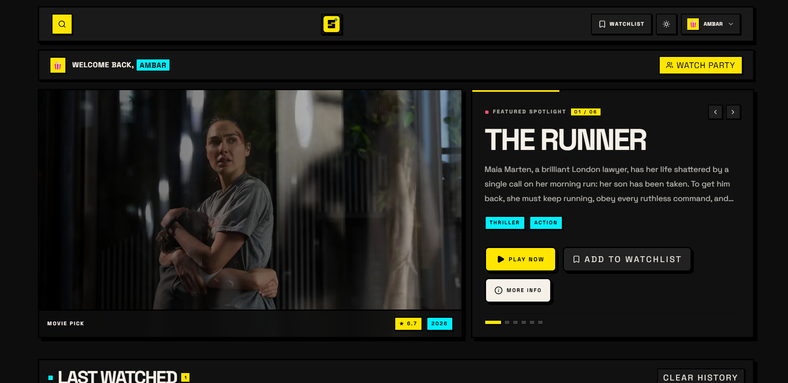
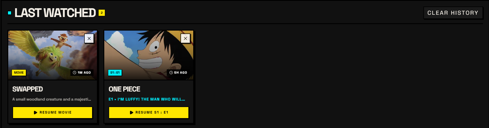
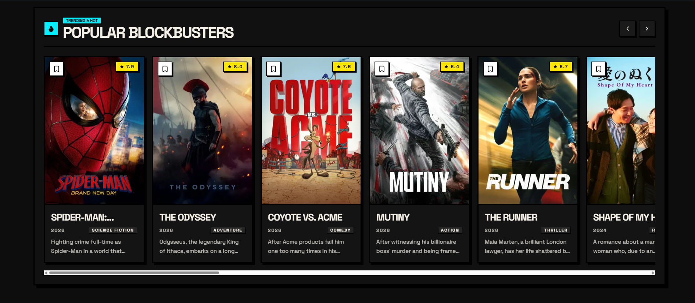
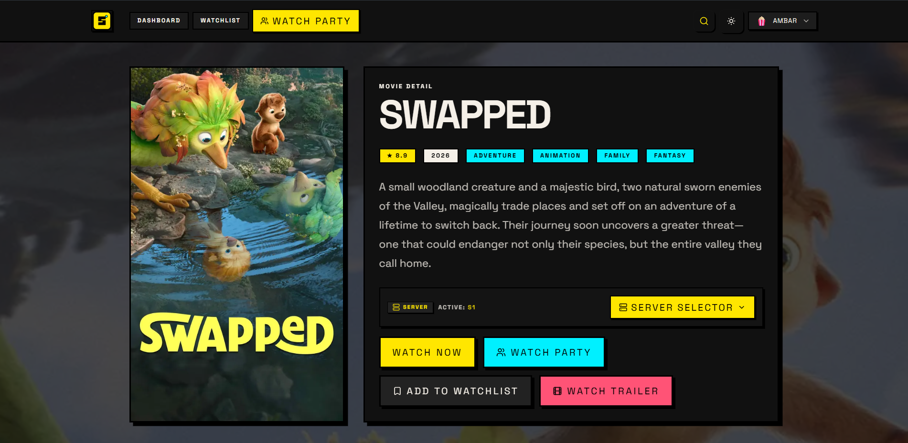
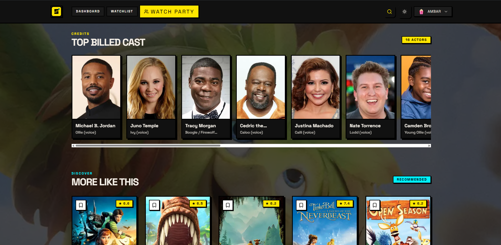
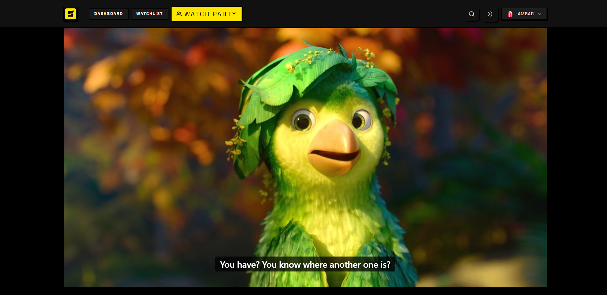
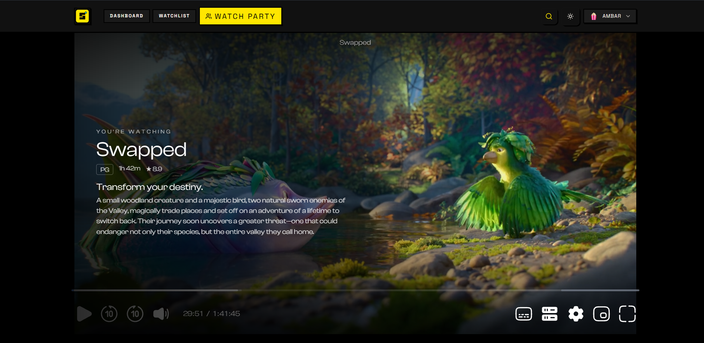
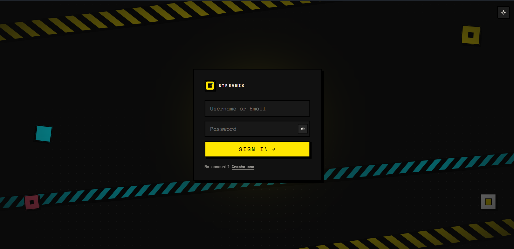
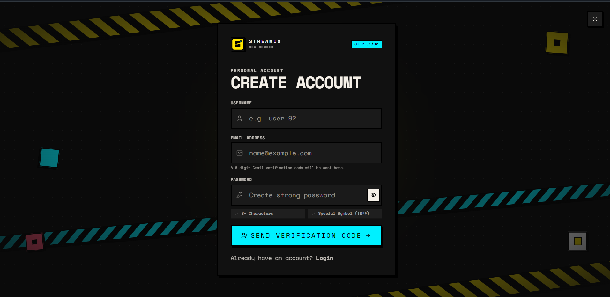

<div align="center">


# STREAMIX

**A High-Performance Plex Media Server UI & Home Theater Dashboard**

[](https://nextjs.org/)
[](https://react.dev/)
[](https://www.typescriptlang.org/)
[](https://expressjs.com/)
[](https://socket.io/)
[](https://webrtc.org/)
[](https://tailwindcss.com/)
[](https://web.dev/progressive-web-apps/)
[](LICENSE)

<p align="center">
  A self-hosted Neo-Brutalist media streaming interface and cinema dashboard tailored for personal home servers and Plex setups. Powered by free TMDB cinema metadata, real-time WebRTC social watch parties, multi-server playback redundancy, and offline-first client persistence.
</p>

[Overview](#overview) • [Visual Showcase](#visual-showcase) • [Core Capabilities](#core-capabilities) • [System Architecture](#system-architecture) • [Project Structure](#project-structure) • [Installation & Setup](#installation--setup) • [Environment Variables](#environment-variables) • [API Reference](#api-reference) • [License](#license)

</div>

---

## Overview

**STREAMIX** was engineered as a dedicated, modern **Plex Media Server UI** and home theater dashboard for private home servers. Built with a distinctive **Neo-Brutalist design language** (bold high-contrast borders, offset drop shadows, sharp typography, and deliberate accents), it delivers an immersive home entertainment experience that bridges catalog exploration, deep metadata intelligence, continuous watch history, and synchronized multi-user watch parties.

### Why STREAMIX?
- **Plex & Home Server Friendly**: Designed to run seamlessly atop a personal home server, homelab, or NAS. Connects your media libraries to an ultra-responsive, mobile-optimized frontend.
- **Free Cinema Metadata via TMDB**: All media artwork, backdrops, trailers, overviews, ratings, and cast directories are fetched on demand from **The Movie Database (TMDB) free public API**.
- **Offline Catalog Resilience**: Includes a built-in static catalog and caching layer, enabling complete offline browsing without requiring an active external API connection.
- **Decoupled Architecture**: Can operate as an autonomous, zero-config serverless web app on Vercel, or be deployed alongside its Express 5 REST service and WebRTC Socket.io signaling server.

---

## Visual Showcase

### 1. Catalog Dashboard & Continuous Playback Tracking
Dynamic spotlight hero banner with instant trailer previews, a persistent "Last Watched" shelf for resuming movies and TV series, and curated trending galleries.







---

### 2. Media Intelligence & Deep Cast Insights
Comprehensive title overviews with high-contrast badges, streaming server selection drawer, trailer modals, complete cast rosters, and intelligent recommendation matrices.





---

### 3. Cinematic Multi-Server Video Player
High-definition responsive player deck with automated ad-suppression parameters, mobile safe-area insets, continuous playback tracking, and interactive cinema overlay controls.





---

### 4. Neo-Brutalist Security & Authentication
Custom authentication portal with PBKDF2 cryptographic hashing, live password strength validation, and 6-digit Gmail OTP email verification.

<div align="center">
  
  
</div>

---

## Core Capabilities

### Real-Time WebRTC Watch Parties
- **Peer-to-Peer Synchronization**: Connects host and viewers using low-latency WebRTC data channels and media streams.
- **Signaling Server**: Standalone Socket.io service for SDP offer/answer exchanges and ICE candidate gathering.
- **In-Room Social Features**: Real-time room chat and floating animated reaction bursts.
- **Instant Sharing**: Automated generation of shareable room codes and direct join links.

### Free TMDB Cinema Metadata Engine
- **Rich Media Catalog**: Dynamic queries across movies and TV series using TMDB's free API endpoints.
- **Granular Cast Profiles**: Detailed actor directories, character assignments, profile photography, and filmographies.
- **Full Series Hierarchies**: Deep season-by-season and episode-by-episode overviews, air dates, and thumbnails.
- **Zero-Config Offline Fallback**: Bundled fallback dataset keeps the entire dashboard functional even without an API key or internet access.

### Resilient Multi-Server Streaming
- **Multi-Mirror Redundancy**: Multi-server mirror configuration with automated failover and customizable base URLs.
- **Slide-Up Server Drawer**: Bottom-sheet drawer for fast server switching without losing active playback state.
- **Ad Suppression Engine**: Appends ad-blocking query parameters to embed requests for an uninterrupted viewing experience.
- **Persistent Preferences**: Saves selected server preferences locally and within the user profile.

### Quick-Search Spotlight (Cmd + K / Ctrl + K)
- **Global Keyboard Shortcut**: Trigger the search spotlight from any page or view.
- **Debounced Matching**: Instant title search across movie and television catalogs.
- **Rich Previews**: Real-time result previews featuring poster art, release year, rating badges, and direct navigation.
- **Recent Search History**: Persisted locally with one-tap query clearing.

### Cryptographic Security & OTP Verification
- **PBKDF2 Password Hashing**: 100,000 iterations of SHA-512 with unique 16-byte random salts.
- **Constant-Time Verification**: Uses timing-safe comparisons to eliminate side-channel timing attacks.
- **Email Verification**: Dispatches 6-digit verification OTP codes via Gmail SMTP with a 10-minute expiry window.
- **Dev-Mode Fallback**: Automatically outputs OTP codes to the server console when SMTP is unconfigured for frictionless local testing.

### Progressive Web App (PWA) & Neo-Brutalism
- **Distinct Design System**: High-contrast borders, bold geometry, offset shadows, and clean typographic scale.
- **Theme Switcher**: Fluid dark and light mode toggle with persistent state across sessions.
- **Standalone PWA**: Includes Web App Manifest and Service Worker install prompts for desktop and mobile installations.
- **Mobile Viewport Optimization**: Native safe-area inset padding and touch-friendly controls.

---

## System Architecture

```mermaid
flowchart TB
    subgraph Client["Frontend Client (Next.js 16 + React 19)"]
        UI["Neo-Brutalist UI & Motion"]
        Spotlight["Spotlight Search (Cmd+K)"]
        Player["Multi-Server Player Deck"]
        WPClient["WebRTC WatchParty Client"]
    end

    subgraph Signaling["Real-Time Layer (Node.js)"]
        SocketIO["Socket.io Signaling Server (Port 4000)"]
        SDP["SDP Offer / Answer & ICE Exchange"]
    end

    subgraph InternalAPI["Next.js Serverless API (App Router)"]
        AuthRoute["/api/auth (PBKDF2 & OTP)"]
        MediaRoute["/api/movies & /api/tv"]
        FallbackStore["Static Offline Catalog Cache"]
    end

    subgraph BackendAPI["Dedicated REST API (Express 5)"]
        ExpressRouter["Express 5 Router (Port 5000)"]
        JWT["JWT Auth & Bcrypt/PBKDF2"]
        MongoStore["MongoDB / In-Memory Store"]
    end

    subgraph ExternalServices["External Services"]
        TMDB["TMDB API v3 (Free Metadata & Posters)"]
        Gmail["Gmail SMTP (OTP Verification)"]
        StreamServers["Multi-Mirror Embed Providers"]
    end

    Client -->|WebSocket Signaling| SocketIO
    SocketIO --> SDP
    Client -->|P2P Media & Data Channels| Client
    Client -->|Internal Fetch| InternalAPI
    Client -->|Optional REST Call| BackendAPI

    InternalAPI -->|Free Metadata Queries| TMDB
    InternalAPI -->|Offline Fallback| FallbackStore
    InternalAPI -->|Verification OTP| Gmail

    BackendAPI --> MongoStore
    BackendAPI --> TMDB

    Player -->|Embed Request + Ad Filters| StreamServers
```



---

## Project Structure

```
STREAM-IX/
├── assets/
│   ├── logo.png                  # Project brand logo
│   └── screenshots/              # High-resolution application screenshots
├── frontend/
│   ├── app/                      # Next.js 16 App Router
│   │   ├── (auth)/               # Login & Sign-up portal pages
│   │   ├── dashboard/            # Main Plex cinema dashboard
│   │   ├── movies/[id]/          # Movie details & streaming view
│   │   ├── series/[id]/          # TV series details, seasons & episodes
│   │   ├── watchlist/            # Bookmarked media management
│   │   ├── watchparty/[roomId]/  # WebRTC synchronized watch party room
│   │   ├── api/                  # Built-in serverless API handlers
│   │   │   ├── auth/             # Sign-up, login, and OTP verification
│   │   │   ├── movies/           # Movie discovery & TMDB search
│   │   │   ├── tv/               # TV series discovery & season endpoints
│   │   │   ├── watchlist/        # Bookmark persistence
│   │   │   └── watchparty/       # Room state coordination
│   │   ├── globals.css           # Tailwind CSS v4 & theme tokens
│   │   └── layout.tsx            # Root layout, typography, and providers
│   ├── components/               # Modular UI components
│   │   ├── VideoPlayer.tsx       # Video embed with mobile control deck
│   │   ├── WatchParty.tsx        # WebRTC synchronized streaming engine
│   │   ├── WatchPartyChat.tsx    # Live in-room messaging
│   │   ├── WatchPartyReactions.tsx # Floating animated emoji reactions
│   │   ├── SearchSpotlight.tsx   # Global search modal (Cmd+K)
│   │   ├── ServerDrawer.tsx      # Slide-up mirror selector
│   │   └── ui/                   # Reusable atomic UI primitives
│   ├── hooks/                    # Custom hooks (useWebRTC, useTheme, useDebounce)
│   ├── lib/                      # Business logic, normalizers, and storage engines
│   │   ├── tmdbServer.ts         # Server-side TMDB client & offline cache
│   │   ├── userStore.ts          # PBKDF2 cryptography & user store
│   │   ├── emailService.ts       # Gmail SMTP transporter & dev fallback
│   │   ├── videoSource.ts        # Streaming URL generators & ad suppression
│   │   └── socket.ts             # Socket.io client configuration
│   ├── public/                   # PWA manifest, service worker, and icons
│   └── .env.example              # Frontend environment configuration template
├── backend/                      # Optional standalone Express 5 REST API
│   ├── src/
│   │   ├── server.js             # Express application entrypoint
│   │   ├── routes/               # Modular REST endpoints (auth, movies, watchlist)
│   │   ├── middleware/           # JWT authentication guards
│   │   └── lib/tmdb.js           # Backend TMDB client
│   └── .env.example              # Backend environment template
├── signaling-server/             # Standalone WebRTC Signaling Server
│   ├── server.js                 # Socket.io room & peer coordination logic
│   └── package.json
└── README.md
```

---

## Installation & Setup

### Prerequisites
- Node.js (v18.18.0 or higher)
- npm or pnpm

---

### 1. Frontend Setup (Standalone & Self-Contained)

The frontend contains its own built-in serverless API and rich offline fallback catalog. It can run completely independently:

```bash
# Navigate to frontend directory
cd frontend

# Install dependencies
npm install

# Copy environment configuration
cp .env.example .env.local

# Start development server
npm run dev
```

Open `http://localhost:3000` in your browser.

> [!NOTE]
> Even without a `TMDB_API_KEY`, Streamix loads its built-in offline catalog, ensuring full immediate functionality without external dependencies.

---

### 2. WebRTC Signaling Server (For Watch Parties)

To enable peer-to-peer Watch Parties locally:

```bash
# Navigate to signaling-server
cd signaling-server

# Install dependencies
npm install

# Start signaling server
npm start
```

The signaling server starts on port `4000` (health check: `http://localhost:4000/health`).

---

### 3. Backend API (Optional Express 5 Service)

If running the dedicated Express API alongside the frontend:

```bash
# Navigate to backend
cd backend

# Install dependencies
npm install

# Copy environment configuration
cp .env.example .env

# Start backend server
npm run dev
```

The Express API starts on port `5000` (health check: `http://localhost:5000/api/health`).

---

## Environment Variables

### Frontend (`frontend/.env.local`)
| Variable | Required | Default | Description |
|---|:---:|---|---|
| `NEXT_PUBLIC_API_URL` | Optional | `/api` | Base URL for internal API requests. |
| `NEXT_PUBLIC_VIDEO_BASE_URL` | Optional | `https://embed.stream-service.org/1` | Base URL for primary video provider. |
| `NEXT_PUBLIC_ENABLE_EXTERNAL_STREAMING` | Optional | `true` | Enables or disables external video embeds. |
| `NEXT_PUBLIC_SIGNALING_URL` | Optional | `http://localhost:4000` | Socket.io WebRTC signaling endpoint. |
| `TMDB_API_KEY` | Optional | `--` | Free TMDB API v3 key (falls back to offline catalog if omitted). |
| `GMAIL_USER` | Optional | `--` | Gmail address for sending real 6-digit OTP verification codes. |
| `GMAIL_APP_PASSWORD` | Optional | `--` | 16-character Google App Password for SMTP dispatch. |

### Backend (`backend/.env`)
| Variable | Required | Default | Description |
|---|:---:|---|---|
| `PORT` | Optional | `5000` | Port for Express API server. |
| `JWT_SECRET` | Required | `--` | Secret key for signing and validating JWT session tokens. |
| `TMDB_API_KEY` | Optional | `--` | Free TMDB API v3 key for backend metadata lookups. |
| `MONGO_URI` | Optional | Localhost | MongoDB connection string (falls back to in-memory store if unreachable). |

---

## API Reference

All routes are implemented in both the Next.js serverless handlers (`frontend/app/api/...`) and Express REST API (`backend/src/...`).

### Authentication
- `POST /api/auth/send-verification` — Validates email & dispatches 6-digit OTP code.
- `POST /api/auth/verify-signup` — Verifies OTP, applies PBKDF2 hashing, and registers account.
- `POST /api/auth/login` — Authenticates user via timing-safe password verification.

### Media Discovery
- `GET /api/movies/trending` — Returns weekly trending titles with TMDB normalization.
- `GET /api/movies/popular` — Returns top popular blockbusters.
- `GET /api/movies/search?q={query}` — Debounced title search across catalog.
- `GET /api/movies/{id}` — Detailed movie metadata, trailer keys, cast list, and recommendations.
- `GET /api/tv/trending` & `GET /api/tv/{id}` — TV series metadata and season episode catalogs.

### Watchlist & Social
- `GET /api/watchlist` — Retrieves authenticated user's bookmarked media.
- `POST /api/watchlist` — Adds media item to user's cloud watchlist.
- `DELETE /api/watchlist/{id}` — Removes an item from the watchlist.
- `POST /api/watchparty` — Creates a synchronized viewing room with custom room code.

---

## Deployment

- **Frontend**: Deployable to [Vercel](https://vercel.com) or any Node.js container host.
- **Signaling Server**: Deployable to any Node.js container or PaaS with WebSocket support enabled.
- **Backend API**: Deployable to any Node.js serverless or container environment.

---

## License

This project is licensed under the [MIT License](LICENSE).
